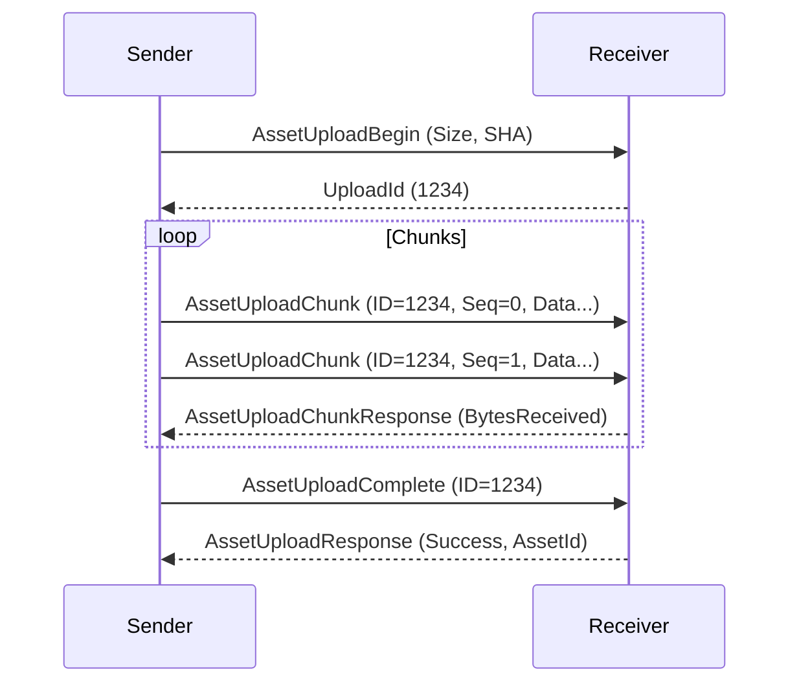

# Asset Transport Protocols

The Asset System uses multiple transport strategies depending on asset size and connection type.

## Small Assets
For assets smaller than a configurable threshold (typically < 1MB), the data is sent directly in the `AssetFetchResponse` or `AssetUploadResponse` message on the Reliable channel.

## Large Assets (Chunked Upload)
For larger files, the system uses a chunked transfer protocol to avoid blocking the main thread or saturating memory.
1.  **Begin**: Sender requests upload (`AssetUploadBegin`), receiver allocates resources and returns an `UploadId`.
2.  **Chunk**: Sender transmits chunks sequentially (`AssetUploadChunk`).
3.  **Complete**: Sender finalizes (`AssetUploadComplete`), receiver assembles and verifies the SHA-256 hash.

## WebRTC Data Channels
When using `WebRTCConnection`, assets can be transferred on a dedicated high-throughput data channel (separate from the reliable control channel) to prevent head-of-line blocking for latency-sensitive data.
