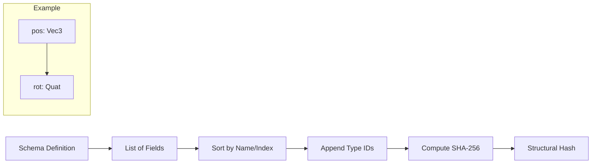

# Component Schemas (Under the Hood)

Component Schemas define the structure of ECS components (e.g., `Transform`, `Mesh`, `Light`) in a way that allows different applications (Canvas vs Paint) to communicate even if they are built with different versions of the engine.

## Structural Hashing

Every schema is identified by a **Structural Hash**. This hash is derived from the field names, types, and order defined in the schema.
*   **Version Independent**: Renaming a field or changing a type results in a new hash, preventing silent data corruption.

## ComponentSchemaRegistry

The `ComponentSchemaRegistry` is the central authority for managing schemas at runtime.
*   **Discovery**: Allows applications to publish their known schemas to peers.
*   **Validation**: Checks if an incoming `EntityCreated` message uses a schema that is compatible with the local application.
*   **Privacy**: Schemas can be marked as `Public` (discoverable) or `Private` (internal only).
