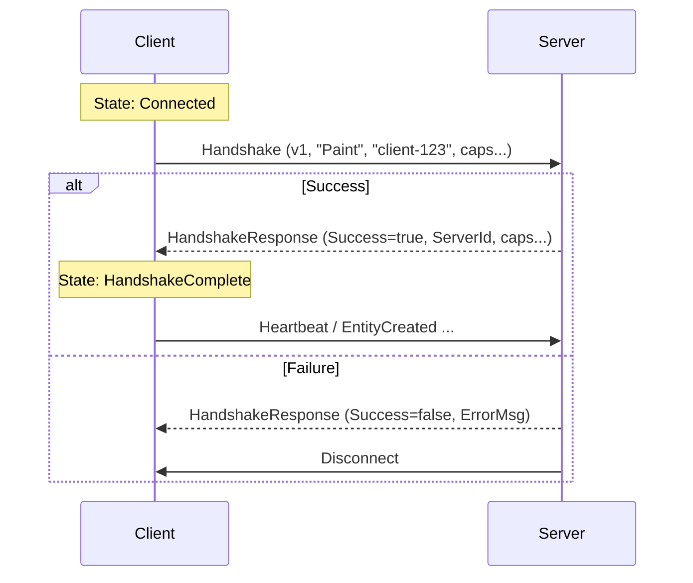

# Handshake & Negotiation

The Handshake is the first exchange of messages after a physical connection is established. It serves three purposes:

1.  **Protocol Versioning**: Ensures client and server speak the same Cap'n Proto schema version.
2.  **Identity**: Establishes the `ClientType` (Portal, Paint, Canvas) and `ClientId`.
3.  **Capability Negotiation**: Feature flags for optional protocol extensions (Schema Metadata, ACKs, etc.).

## Protocol Flow

The handshake is synchronous on the Reliable channel. All other messages (EntityCreated, etc.) are blocked until the handshake completes.



## Structure

Defined in `entropy.capnp`:

```capnp
struct Handshake {
    protocolVersion @0 :UInt32;
    clientType @1 :Text;             # "portal", "paint", "canvas"
    clientId @2 :Text;

    # Capability flags (added for protocol evolution)
    supportsSchemaMetadata @3 :Bool = false;  # Supports required/defaultValue in PropertyDefinitionData
    supportsSchemaAck @4 :Bool = false;       # Supports acknowledgment of schema registration
    supportsSchemaAdvert @5 :Bool = false;    # Supports schema advertisement/discovery
}
```

## Usage

### Client Side
The client initiates the handshake immediately after connection.

```cpp
// Explicitly perform handshake
auto result = session->performHandshake("EntropyPaint", "paint-instance-1");
if (result.failed()) {
    // Handle error
}
```

### Server Side
The server receives the handshake and invoking the callback registered via `SessionManager`.

```cpp
manager.setHandshakeCallback(session, [](const std::string& type, const std::string& id) {
    ENTROPY_LOG_INFO("Client connected: {} ({})", type, id);
    // Return void implies acceptance. To reject, throw or return error (future API).
});
```
