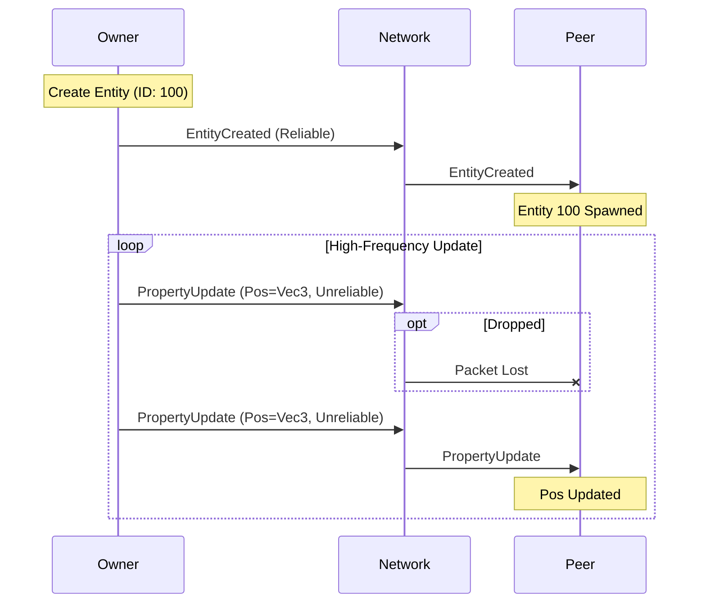

# Replication Model

Entropy uses a **State Replication** model rather than pure event streaming.

## Authority
Only the "Owner" of an entity can modify its component structure (add/remove components) or destroy it.

*   **Eventual Consistency**: The system guarantees that all peers will eventually converge on the same state, even if intermediate updates are dropped (via Unreliable channels).

## Asset Integration
The Session Layer integrates tightly with the Asset System.
*   **Lazy Loading**: Assets (textures, meshes) are only fetched when referenced by a replicated entity.
*   **Content Addressing**: Assets are identified by their SHA-256 hash (`AssetId`), allowing for efficient caching and avoiding duplication.
