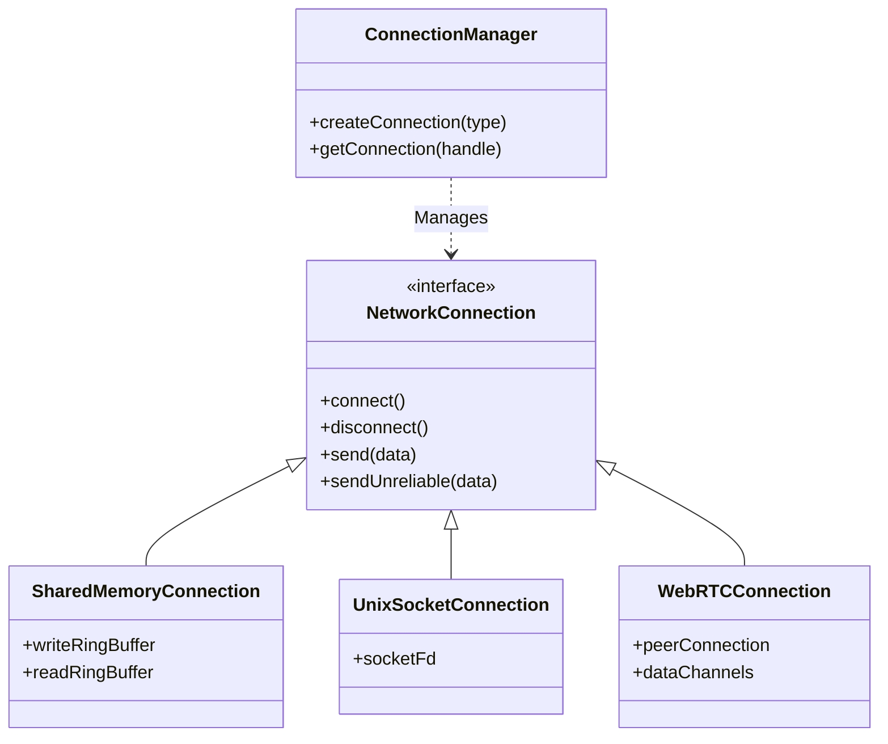

# Transport Layer Overview

The Transport Layer is responsible for establishing connections and moving data between endpoints. It abstracts platform-specific IPC mechanisms and remote networking into a unified `NetworkConnection` interface.

## Core Components

### ConnectionManager
The `ConnectionManager` is the central hub for all network activity. It uses a **slot-based architecture** (similar to `WorkContractGroup`) to manage connections lock-free.

*   **Platform Agnostic**: Automatically selects the best backend for the target (e.g., Unix Socket on macOS, Named Pipe on Windows).
*   **Generational Handles**: Returns `ConnectionHandle`s that are safe to use even if the underlying connection is closed and the slot is reused.
*   **Metrics**: Tracks global bandwidth, message counts, and connection health.

*   `trySend()` (Non-blocking with backpressure)

## Class Hierarchy

