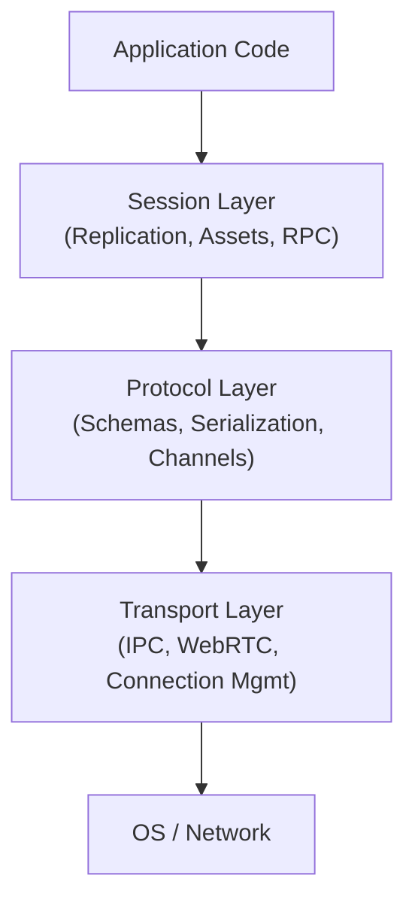

# Architecture Overview

EntropyNetworking is built on a layered architecture designed to provide flexibility, performance, and scalability.

## Layers

### [1. Session Layer](./Session/)
The intelligent core. Manages the lifecycle of connections and provides high-level features like Entity Replication and Asset Management.
*   **[Replication](./Session/Replication.md)**: State synchronization logic.
*   **[Handshake](./Session/Handshake.md)**: Connection negotiation.

### [2. Protocol Layer](./Protocol/)
Defines the wire format and data structure.
*   **[Schemas](./Protocol/Schemas.md)**: Component compatibility and versioning.
*   **serialization**: Cap'n Proto zero-copy encoding.

### [3. Transport Layer](./Transport/)
Abstracts the physical movement of bytes.
*   **[IPC](./Transport/IPC.md)**: Shared Memory, Unix Sockets.
*   **[WebRTC](./Transport/WebRTC.md)**: Remote connectivity.

### [4. Asset System](./Assets/)
Integrated content delivery network.
*   **[Transport](./Assets/Transport.md)**: Chunked uploads and data channels.
